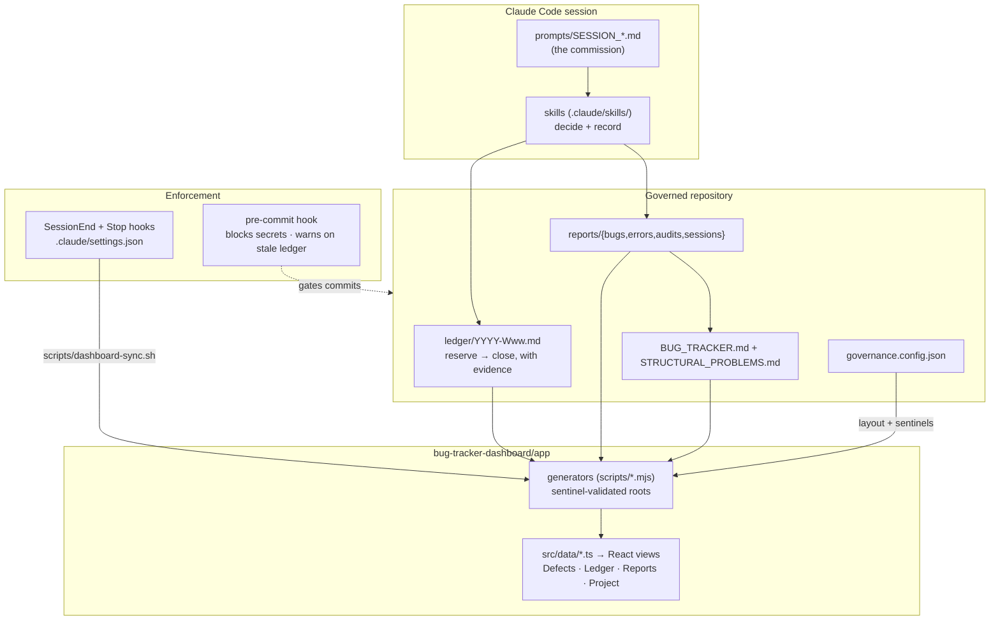

# claude-governance-kit

A project governance system for AI-assisted development with Claude Code. It gives any
repository an **execution ledger**, a **defect tracker**, a **reporting protocol**, a set
of **behavioural skills**, **enforcement hooks**, and a **local dashboard** that renders
all of it — so that what an AI session started, changed, verified, and left open is
always written down, and always visible.

Battle-tested on a real iOS project (58 tracked bugs, 50+ ledger entries), extracted
project-agnostic.

## The problem it solves

AI coding sessions produce work with no memory: a fix recorded as done that nobody
verified, a failure logged nowhere, a decision re-litigated every session, a credential
committed once and living in history forever. This kit is the discipline layer that
prevents that — as files, scripts, and hooks inside the repo, not as a service.

## What you get

| Piece | What it is |
|---|---|
| `ledger/` | Append-only execution log — one entry per task: reserved before work, closed after, with evidence |
| `reports/` | Bug / error / audit / session reports, each written with its own skill |
| `reports/bugs reports/BUG_TRACKER.md` | The live defect register, with an honest status vocabulary (fixed ≠ verified) |
| `STRUCTURAL_PROBLEMS.md` | The second register: tooling and process defects, plus lessons |
| `.claude/skills/` | 14 skills: six that record what happened, eight that decide what to do |
| `.claude/rules/` | Path-scoped invariants that load only when relevant code is opened |
| `scripts/` | Pre-commit gate (secrets block, ledger checks), ledger-id allocator, dashboard sync |
| `bug-tracker-dashboard/` | Local Vite/React dashboard generated from the Markdown — ledger, defects, reports, project inventory |
| `governance.config.json` | The single config file that adapts everything to your project |
| `prompts/` | Session prompts: a commission per session, sized to one context window |

## Install into a project

```bash
git clone https://github.com/<you>/claude-governance-kit
cd claude-governance-kit
./install.sh /path/to/your/project
```

The installer asks three questions (project name, short id, source directory), copies
everything in **without overwriting anything that already exists**, writes
`governance.config.json`, and installs the git pre-commit hook. Then:

```bash
cd /path/to/your/project/bug-tracker-dashboard/app
npm install && npm run sync && npm run dev   # → http://localhost:5173
```

## How it works



The flow: **work is commissioned** by a session prompt, **recorded** in the ledger as it
happens, **written up** by the reporting skills, **gated** by the pre-commit hook, and
**published** to the dashboard automatically at session end (and per turn) — idempotently,
keyed on what actually changed.

## The design rules that make it work

- **The ledger is the spine.** Reserve before starting, close when done, cite the entry ID
  from every other record. Nothing is duplicated into the ledger; it points outward.
- **Fixed is not verified.** The tracker separates *fixed, unverified* (a commit exists)
  from *fixed, verified* (named evidence exists). The dashboard renders the split.
- **Loud failure over silent skip.** Every generator validates its roots by sentinel and
  dies loudly; the sync hook logs every skip to a file *outside* the repo.
- **Block only what is never legitimate.** The pre-commit hook blocks credentials and
  warns on everything else — a gate that blocks real work gets bypassed until it means
  nothing.
- **No cron.** The dashboard syncs inside sessions only; a scheduler would be a second
  writer to the working tree.

Full description with the diagram rendered: open **`docs/index.html`** in a browser.

## Optional module

`modules/swift-xcode/` contains a Swift/Xcode audit skill, kept out of the core kit
because it is toolchain-specific.

## Licence

MIT. The five vendored skills listed in `.claude/skills/UPSTREAM.md` are MIT-licensed by
Matt Pocock; provenance and licence text are in that file.
